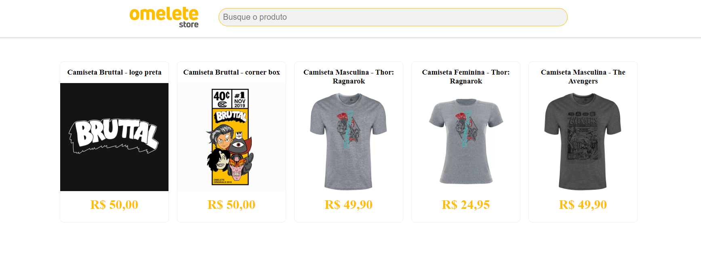

<p align="center">
    
</p>

<p align="center">
    


<a href="https://www.linkedin.com/in/alquiponeto/">
    
</a>

<a href="https://github.com/Alquipo/Desafio-Calindra-FrontEnd1/commits/master">
    
</a>


<a href="https://app.netlify.com/sites/distracted-mahavira-883d26/deploys">
    
</a>

<p align="center">

  <a target="_blank" href="https://reactjs.org/">
    
  </a>
</p>

## 🚀 Sobre o desafio

Construir uma aplicação na linguagem que preferir e achar mais prático. Neste desafio não
é preciso desenvolver um layout robusto, pode ser algo simples. A aplicação deverá ter um input de
texto e um botão busca que ao ser clicado realizará uma busca de produto através do consumo da
mesma api usada pelo autocomplete do site https://store.omelete.com.br . Você deverá analisar a
resposta da API e construir uma view com a lista dos produtos retornados.

## 🎨 Layout

<p align="center">

  
  
</p>

<div align="center">

<button><a target="_blank" href="https://omeletestore.alquipo.dev/"></img></a></button>

</div>

## 🔨 Tecnologias:

- [React JS][reactjs]
- [Styled Components](https://styled-components.com/)
- [Axios](https://github.com/axios/axios)

## 🚀 Como rodar este projeto

Para clonar e executar este aplicativo, você precisará de [Git](https://git-scm.com), [NodeJs][nodejs] Instalado em seu computador.

### 🌀 Clonando o repositório

```bash
# Clone este repositório
$ git clone https://github.com/Alquipo/Desafio-Calindra-FrontEnd1

# Acesse a pasta do projeto no terminal/cmd
$ cd Desafio-Calindra-FrontEnd1
```

### 🧭 Rodando a aplicação web

```bash
# Instale as dependências
$ npm install

# Execute a Aplicação
$ npm run start

# O servidor inciará na porta:3000 - acesse http://localhost:3000
```

## 🤔 Como contribuir para o projeto

- Faça um **fork** do projeto;
- Crie uma nova branch com as suas alterações: `git checkout -b my-feature`
- Salve as alterações e crie uma mensagem de commit contando o que você fez:`git commit -m "feature: My new feature"`
- Envie as suas alterações: `git push origin my-feature`

> Caso tenha alguma dúvida confira este [guia de como contribuir no GitHub](https://github.com/firstcontributions/first-contributions)

## 📝 Licença

Este projeto esta sobe a licença MIT. Veja a [LICENÇA][license] para saber mais.

Feito com ❤️ por Alquipo Neto 👋🏽 [Entre em contato!](https://www.linkedin.com/in/alquiponeto/)

[reactjs]: https://reactjs.org/
[nodejs]: https://nodejs.org/en/
[rs]: https://rocketseat.com.br
[license]: https://opensource.org/licenses/MIT
[desafio2]: https://github.com/Alquipo/GoStack12-desafio-02
[typescript]: https://www.typescriptlang.org/
